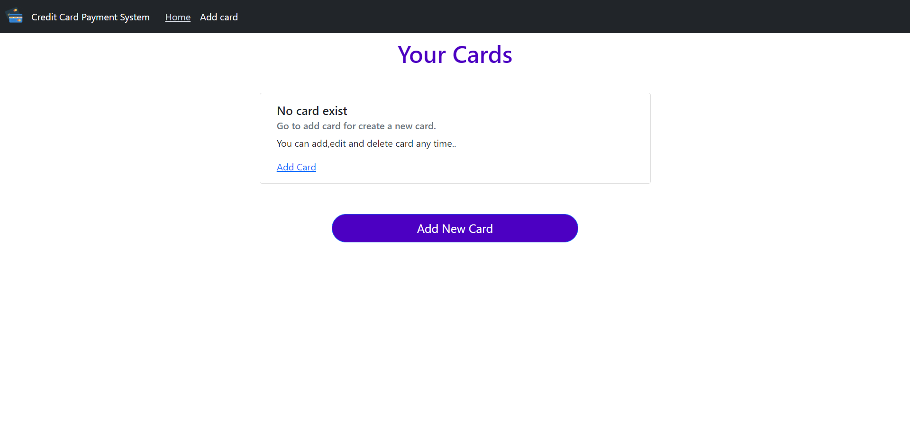
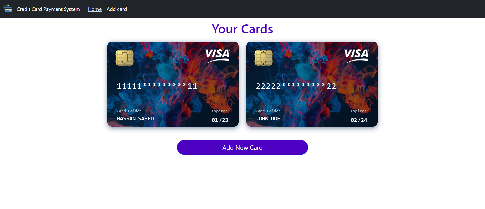
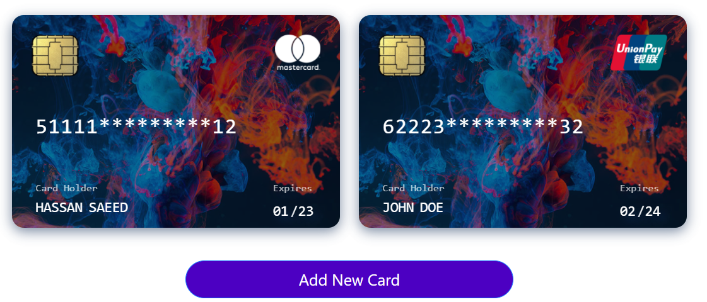
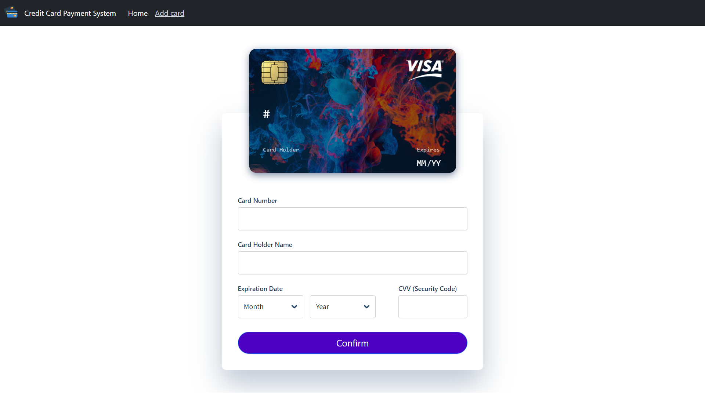
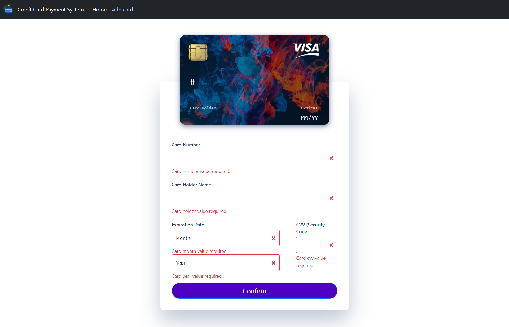
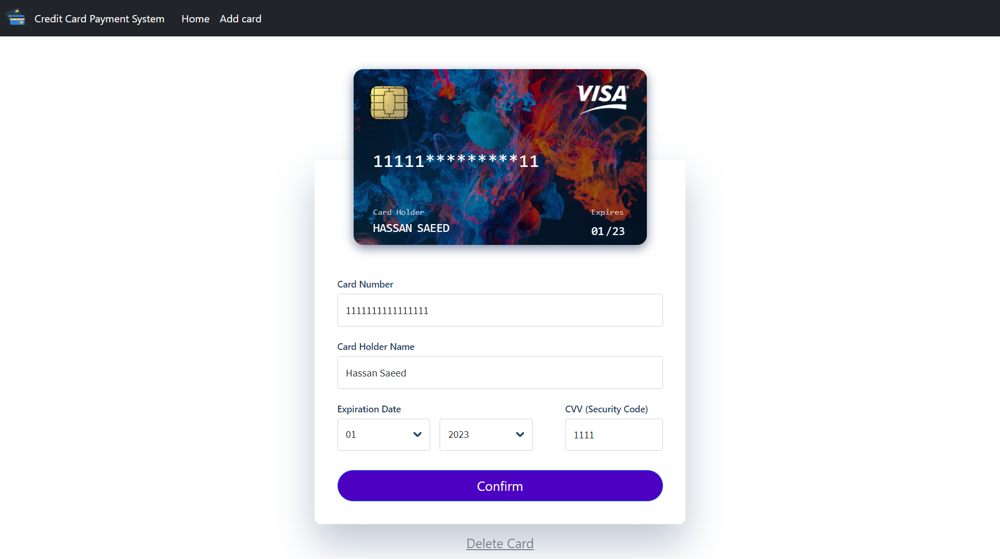
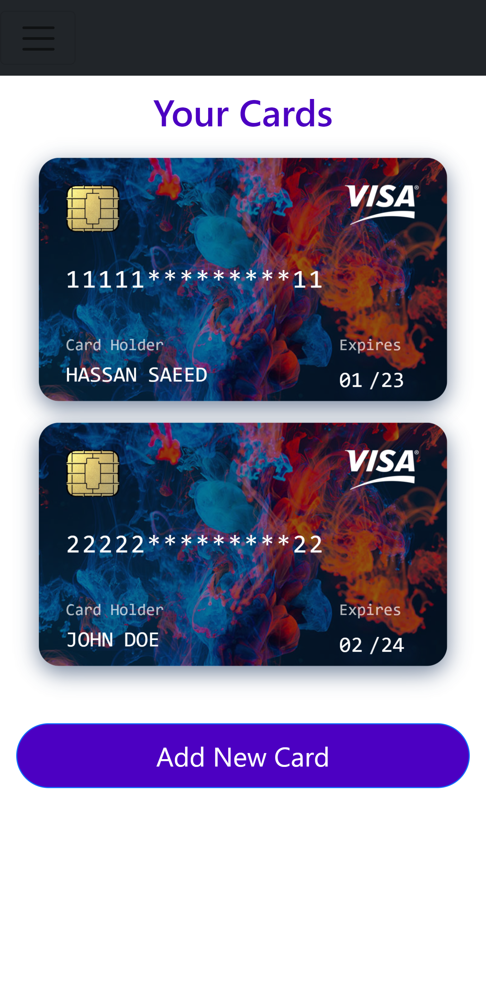
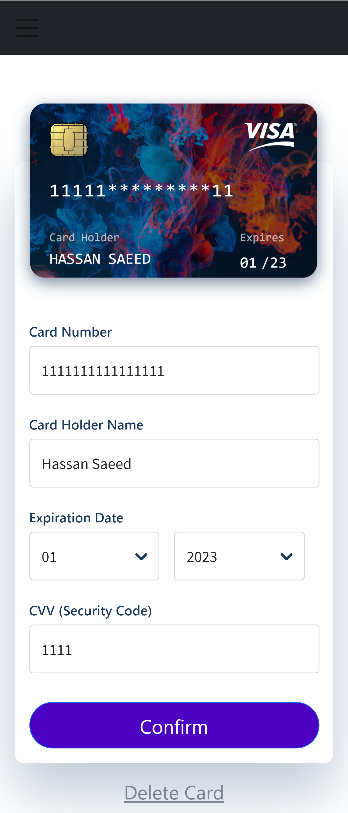

# Credit Card Payment System

A Credit Card Payment System - CCPS build with react, typescript, bootstrap, sass, react-transition, font-awesome

## Demo video

**Project Demo Video :-**

 \
or\
https://youtu.be/fjGWULgM9z8

#### Run:

### `npm install`

### `npm start`

http://localhost:3000

## Demo Snapshots

# `Home Page`

# `Listing Cards Page`

# `Supported Card Type like Visa, Master, Unionpay etc`

# `Add Card Page`

# `Form Validation`

# `Edit Card Page(with delete option)`

# `Mobile Layout for Listing Page`

# `Mobile Layout for Add/Edit/delete Page`

## Future Work Improvements

- Integrate API layer if need to link with any restful API
- Form fields Validation using Regex
- add helper or common class
